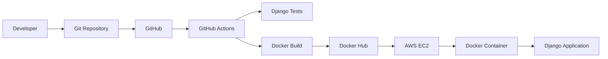
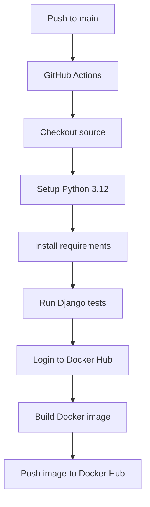

# Django Docker DevOps Project

A hands-on DevOps project built around a small Django web application. The goal of this project is to take a working application, package it as a Docker image, publish that image to Docker Hub, and automate the build and test process with GitHub Actions.

The project was built step by step rather than using a pre-made DevOps template. It covers the parts of a typical application delivery workflow that I wanted to understand in practice: Git, Docker, GitHub Actions, Docker Hub, and deployment to an AWS EC2 server.

> **Project status:** CI and Docker image publishing are working. The application has also been deployed and tested manually on AWS EC2. The automated GitHub Actions → EC2 deployment stage is currently kept separate while the SSH deployment setup is being refined.

---

## Table of Contents

- [Project Overview](#project-overview)
- [What This Project Demonstrates](#what-this-project-demonstrates)
- [Technology Stack](#technology-stack)
- [Architecture](#architecture)
- [Project Structure](#project-structure)
- [Application](#application)
- [Docker Implementation](#docker-implementation)
- [Run the Application Locally](#run-the-application-locally)
- [Docker Workflow](#docker-workflow)
- [Docker Hub](#docker-hub)
- [GitHub Actions CI](#github-actions-ci)
- [AWS EC2 Deployment](#aws-ec2-deployment)
- [Environment and Secrets](#environment-and-secrets)
- [Useful Commands](#useful-commands)
- [Troubleshooting Notes](#troubleshooting-notes)
- [Current Limitations and Next Improvements](#current-limitations-and-next-improvements)
- [What I Learned](#what-i-learned)
- [Resume / Interview Summary](#resume--interview-summary)
- [Author](#author)

---

## Project Overview

This repository contains a Dockerized Django application with a simple web interface.

The application itself is intentionally small. The main focus of the project is the delivery process around the application.

The workflow is:

```text
Developer changes code
        |
        v
     Git
        |
        v
   GitHub Repository
        |
        v
  GitHub Actions
   |          |
   |          +--> Django tests
   |
   +--------------> Docker image build
                         |
                         v
                    Docker Hub
                         |
                         v
                    AWS EC2
                         |
                         v
                 Running container
                         |
                         v
                  Django web app
```

The project is designed as a practical learning project, but the workflow follows patterns that are also used in real development and DevOps environments.

---

## What This Project Demonstrates

### Application

- Django web application
- Basic application routing
- Simple HTML-based interface
- Django development server running inside a container

### Source Control

- Git repository management
- `main` branch workflow
- Meaningful commits
- GitHub repository integration

### Containers

- Dockerfile creation
- Docker image builds
- Docker containers
- Port mapping
- `.dockerignore`
- Container lifecycle management
- Docker image tagging

### CI

GitHub Actions is used to:

1. Check out the source code
2. Set up Python
3. Install dependencies
4. Run Django tests
5. Log in to Docker Hub
6. Build the Docker image
7. Push the image to Docker Hub

### Registry

The application image is published to Docker Hub:

```text
srini9808/docker-django-devops:latest
```

### Cloud

The Docker image was pulled and run on an Ubuntu AWS EC2 instance.

The EC2 deployment was tested manually using SSH and Docker. An automated EC2 deployment stage was also explored in GitHub Actions and is intentionally kept separate while SSH authentication is being refined.

---

## Technology Stack

| Area | Technology |
|---|---|
| Application | Python / Django |
| Source Control | Git |
| Repository | GitHub |
| Containerization | Docker |
| Container Registry | Docker Hub |
| CI | GitHub Actions |
| Cloud | AWS EC2 |
| Server OS | Ubuntu 24.04 LTS |
| Development Environment | WSL2 / Docker Desktop |
| Web Port | 8000 |

---

## Architecture

### High-level architecture



### CI pipeline



The CI workflow intentionally keeps the responsibilities clear: test the application first, then build and publish the container image.

---

## Project Structure

The important files in the repository are organized as follows:

```text
python-web-app/
│
├── .github/
│   └── workflows/
│       └── ci.yml
│
├── .dockerignore
├── .gitignore
├── Dockerfile
├── README.md
├── requirements.txt
│
└── devops/
    ├── manage.py
    ├── db.sqlite3
    ├── demo/
    │   └── ...
    └── devops/
        └── ...
```

### Important files

**`Dockerfile`**

Defines how the Django application is packaged into a Docker image.

**`requirements.txt`**

Contains the Python packages required by the application.

**`.dockerignore`**

Prevents unnecessary local files such as virtual environments, Python cache files, Git metadata, and logs from being included in the Docker build context.

**`.github/workflows/ci.yml`**

Contains the GitHub Actions CI pipeline.

---

## Application

The application is a simple Django web page created for this DevOps project.

The page includes:

- Project title
- Project agenda
- Portfolio link
- LinkedIn link
- GitHub link
- Footer with author information

Example application route:

```text
/demo/
```

When the container is running locally:

```text
http://localhost:8000/demo/
```

When the application is running on EC2:

```text
http://<EC2-PUBLIC-IP>:8000/demo/
```

---

## Docker Implementation

The application is packaged using a Dockerfile based on Ubuntu.

The build process installs:

- Python 3
- pip
- Python virtual environment support
- Application dependencies

A separate Python virtual environment is created inside the container so that the application's dependencies remain isolated from the base operating system.

### Build the image

From the project root:

```bash
docker build -t django-devops-app:latest .
```

A versioned image can also be created:

```bash
docker build -t django-devops-app:v2 .
```

### Check images

```bash
docker images
```

### Run the container

```bash
docker run -d \
  --name django-devops-container \
  -p 8000:8000 \
  django-devops-app:latest
```

### Check the running container

```bash
docker ps
```

### View logs

```bash
docker logs django-devops-container
```

### Stop the container

```bash
docker stop django-devops-container
```

### Remove the container

```bash
docker rm django-devops-container
```

---

## Run the Application Locally

### Prerequisites

Install:

- Git
- Python 3
- Docker Desktop
- WSL2 if working on Windows

### Clone the repository

```bash
git clone https://github.com/srinivasupolamuri/docker-django-devops.git
cd docker-django-devops
```

Move to the application directory if required:

```bash
cd Docker-Zero-to-Hero/examples/python-web-app
```

### Build

```bash
docker build -t django-devops-app:latest .
```

### Run

```bash
docker run -d \
  --name django-devops-container \
  -p 8000:8000 \
  django-devops-app:latest
```

Open:

```text
http://localhost:8000/demo/
```

---

## Docker Workflow

The image follows this basic lifecycle:

```text
Dockerfile
    |
    v
docker build
    |
    v
Local Docker image
    |
    v
docker tag
    |
    v
Docker Hub repository
    |
    v
docker pull
    |
    v
AWS EC2
    |
    v
Docker container
```

### Tag the image for Docker Hub

```bash
docker tag django-devops-app:v2 \
  srini9808/docker-django-devops:latest
```

### Push the image

```bash
docker push srini9808/docker-django-devops:latest
```

### Pull the image

```bash
docker pull srini9808/docker-django-devops:latest
```

---

## Docker Hub

The container image is published to:

```text
srini9808/docker-django-devops
```

Current tag:

```text
latest
```

The repository is used as the image registry between the CI pipeline and the EC2 environment.

A deployment server does not need the application source code to run this image. It can pull the built artifact directly from Docker Hub.

---

## GitHub Actions CI

The repository contains:

```text
.github/workflows/ci.yml
```

The workflow runs when code is pushed to `main` or when a pull request targets `main`.

The current pipeline performs:

```text
Checkout
   ↓
Python setup
   ↓
Install dependencies
   ↓
Django tests
   ↓
Docker Hub login
   ↓
Docker Buildx
   ↓
Docker build
   ↓
Docker push
```

### Example workflow

The important part of the workflow is conceptually:

```yaml
- name: Run Django tests
  run: |
    cd devops
    python manage.py test

- name: Log in to Docker Hub
  uses: docker/login-action@v4
  with:
    username: ${{ vars.DOCKERHUB_USERNAME }}
    password: ${{ secrets.DOCKERHUB_TOKEN }}

- name: Set up Docker Buildx
  uses: docker/setup-buildx-action@v4

- name: Build and push Docker image
  uses: docker/build-push-action@v7
  with:
    context: .
    push: true
    tags: srini9808/docker-django-devops:latest
```

The Docker Hub token is stored as a GitHub Actions secret rather than being written directly into the workflow.

---

## AWS EC2 Deployment

The application was also deployed manually to an Ubuntu EC2 instance to verify that the image produced by the project can run outside the local development environment.

### EC2 configuration used during testing

```text
Instance type: t3.micro
Operating system: Ubuntu 24.04 LTS
Container port: 8000
Application port: 8000
```

### Security group used during testing

```text
SSH         TCP 22
HTTP        TCP 80
Custom TCP  TCP 8000
```

Port `8000` was opened because the Django application is exposed directly from the Docker container during this learning project.

### Pull the image on EC2

```bash
docker pull srini9808/docker-django-devops:latest
```

### Run the container

```bash
docker run -d \
  --name django-devops-container \
  --restart unless-stopped \
  -p 8000:8000 \
  srini9808/docker-django-devops:latest
```

### Verify

```bash
docker ps
```

Expected port mapping:

```text
0.0.0.0:8000->8000/tcp
```

The application can then be accessed using:

```text
http://<EC2-PUBLIC-IP>:8000/demo/
```

### Note about EC2 public IP

The default EC2 public IPv4 address can change after stopping and starting an instance. For a permanent environment, an Elastic IP or another stable endpoint should be considered.

---

## Environment and Secrets

No credentials, access tokens, or private SSH keys should be committed to this repository.

For GitHub Actions, sensitive values belong in:

```text
GitHub Repository
  → Settings
  → Secrets and variables
  → Actions
```

Examples:

```text
DOCKERHUB_TOKEN
```

If an automated EC2 deployment is enabled later, the SSH private key should also be stored as a GitHub Actions secret.

Never place a private key directly in:

- `ci.yml`
- `README.md`
- Dockerfile
- source code
- Git commits

---

## Useful Commands

### Git

```bash
git status
git add .
git commit -m "Update project"
git push
git log --oneline
```

### Docker

```bash
docker ps
docker ps -a
docker images
docker logs django-devops-container
docker exec -it django-devops-container bash
docker stop django-devops-container
docker rm django-devops-container
```

### Docker Hub

```bash
docker login
docker tag <local-image> srini9808/docker-django-devops:latest
docker push srini9808/docker-django-devops:latest
docker pull srini9808/docker-django-devops:latest
```

---

## Troubleshooting Notes

### Docker command not found in WSL

Make sure Docker Desktop is running and WSL integration is enabled for the required Linux distribution.

Verify:

```bash
docker --version
docker info
```

### Container name already exists

If Docker reports that `django-devops-container` already exists:

```bash
docker ps -a
```

Then:

```bash
docker stop django-devops-container
docker rm django-devops-container
```

Run the container again.

### Application is not reachable on port 8000

Check:

```bash
docker ps
```

Confirm that the port mapping contains:

```text
0.0.0.0:8000->8000/tcp
```

Then check:

```bash
docker logs django-devops-container
```

Also verify that the EC2 security group allows TCP port `8000`.

### GitHub Actions succeeds but Docker image is missing

Check:

- Docker Hub username
- Docker Hub token
- GitHub Actions repository variable
- GitHub Actions secret
- image tag

Expected image:

```text
srini9808/docker-django-devops:latest
```

### SSH authentication error during EC2 automation

A message such as:

```text
Permission denied (publickey)
```

means the EC2 server rejected the SSH credentials. The private key used by GitHub Actions must correspond to a public key in the EC2 user's:

```text
~/.ssh/authorized_keys
```

For this project, manual EC2 deployment remains available while the automated SSH deployment is being refined.

---

## Current Limitations and Next Improvements

This project intentionally started with a simple setup. The next improvements would be:

### 1. Optimize the Docker image

The current image works, but it can be made smaller by using an official Python slim base image instead of installing Python on top of Ubuntu.

For example:

```dockerfile
FROM python:3.12-slim
```

This would reduce unnecessary packages and simplify the Dockerfile.

### 2. Better image tagging

Instead of only:

```text
latest
```

future builds could use tags such as:

```text
latest
main
sha-<commit>
v1.0.0
```

This makes it easier to identify exactly which build is deployed.

### 3. Add automated EC2 deployment

The next CI/CD stage would be:

```text
GitHub
   ↓
GitHub Actions
   ↓
Docker Hub
   ↓
EC2
   ↓
docker pull
   ↓
restart container
```

The SSH authentication configuration should be completed carefully before enabling this stage.

### 4. Add Nginx

Instead of exposing Django directly on port `8000`:

```text
Internet
   ↓
Nginx :80
   ↓
Django :8000
```

Nginx could handle the public HTTP endpoint and reverse proxy traffic to the Django container.

### 5. HTTPS

The next production-oriented step would be to configure a domain name and TLS/HTTPS.

### 6. Infrastructure as Code

Terraform can be introduced to create and manage:

- EC2
- Security groups
- Networking
- Elastic IP
- IAM resources

### 7. Monitoring

CloudWatch can be added for:

- CPU utilization
- Instance status
- Logs
- Basic operational monitoring

### 8. Application database

SQLite is suitable for this small demonstration application, but a production Django deployment should use a managed database such as PostgreSQL rather than relying on a local SQLite database inside a container.

---

## What I Learned

This project helped me understand the complete path from source code to a running container:

- How a Dockerfile turns an application into a repeatable image
- How Docker images differ from running containers
- How Docker Hub acts as a container registry
- How GitHub Actions can automate testing and image publishing
- How an EC2 instance can consume a Docker image from a registry
- How security groups affect access to cloud-hosted applications
- How SSH keys are used for server authentication
- Why secrets should be managed outside source code
- How container restart policies help with server restarts
- How to troubleshoot Docker, networking, SSH, and CI failures separately instead of treating them as one problem

The main objective was not to build a complicated application. It was to understand the delivery pipeline around a real application and troubleshoot each layer when something went wrong.

---

## Resume / Interview Summary

A concise way to describe this project in an interview:

> Built and containerized a Django web application using Docker, created a GitHub Actions CI pipeline to run Django tests and build/publish Docker images to Docker Hub, and deployed the container on an Ubuntu AWS EC2 instance. Configured Docker networking, EC2 security groups, SSH-based server access, container restart policies, and troubleshooting across the application, container, CI, and cloud layers.

### Key skills demonstrated

```text
Docker
Git
GitHub
GitHub Actions
Docker Hub
Python
Django
AWS EC2
Linux
Ubuntu
SSH
CI/CD
Containerization
Basic Cloud Networking
Troubleshooting
```

---

## Author

**Srinivasu Polamuri**

GitHub:  
https://github.com/srinivasupolamuri

Docker Hub:  
https://hub.docker.com/u/srini9808

---

## Project Links

- GitHub repository: https://github.com/srinivasupolamuri/docker-django-devops
- Docker Hub image: https://hub.docker.com/r/srini9808/docker-django-devops

---

## Acknowledgements / References

The project uses standard Docker and GitHub Actions workflows. The following official documentation was useful while building and documenting the project:

- Docker Hub documentation
- Docker GitHub Actions documentation
- GitHub repository and README documentation
- GitHub Actions documentation

---

## Final Project Flow

```text
                    ┌───────────────────┐
                    │    Developer      │
                    └─────────┬─────────┘
                              │
                              ▼
                    ┌───────────────────┐
                    │       Git         │
                    └─────────┬─────────┘
                              │ push
                              ▼
                    ┌───────────────────┐
                    │      GitHub       │
                    └─────────┬─────────┘
                              │
                              ▼
                    ┌───────────────────┐
                    │  GitHub Actions   │
                    │                   │
                    │  • Test Django    │
                    │  • Build Docker   │
                    │  • Push image     │
                    └─────────┬─────────┘
                              │
                              ▼
                    ┌───────────────────┐
                    │    Docker Hub     │
                    │                   │
                    │ docker-django-    │
                    │ devops:latest     │
                    └─────────┬─────────┘
                              │
                              │ docker pull
                              ▼
                    ┌───────────────────┐
                    │     AWS EC2       │
                    │     Ubuntu        │
                    └─────────┬─────────┘
                              │
                              ▼
                    ┌───────────────────┐
                    │ Docker Container  │
                    │                   │
                    │ Django :8000      │
                    └─────────┬─────────┘
                              │
                              ▼
                    ┌───────────────────┐
                    │   Web Browser     │
                    │                   │
                    │   /demo/          │
                    └───────────────────┘
```

> **Note:** The final diagram represents the complete project journey. At the current stage, GitHub Actions automatically handles testing and Docker Hub publishing; EC2 deployment has been validated manually while automated EC2 SSH deployment remains a future improvement.
